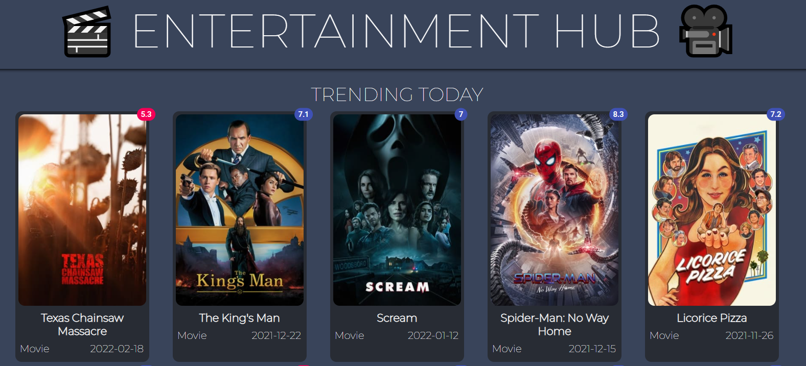
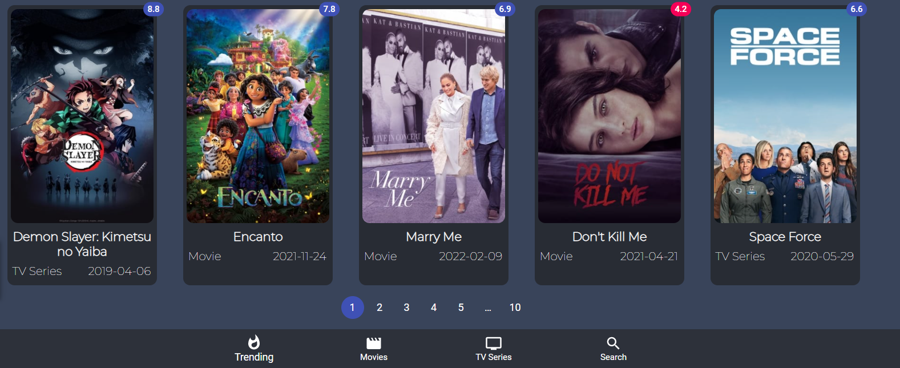
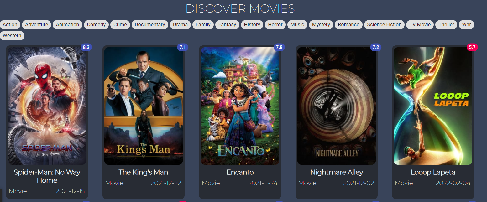
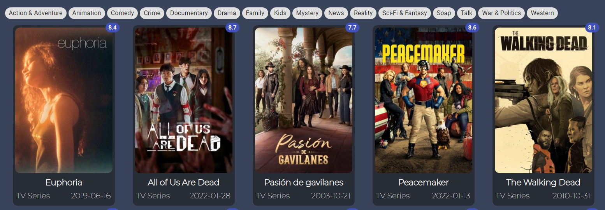
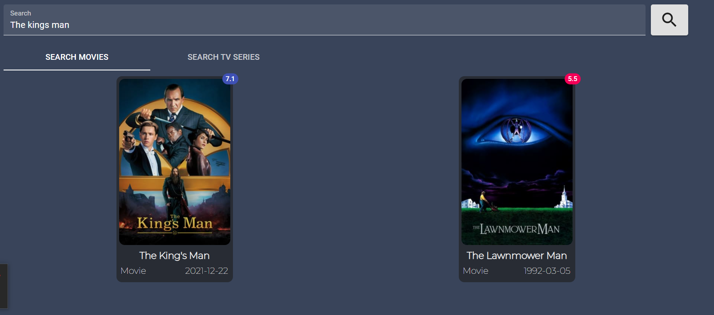

## ENTERTAINMENT-HUB 📽 

An Entertainment-Hub Project built with Reactjs. Users can search for movies on this site & view a list of the latest movies🎥


##### HomePage



##### Footer



##### Latest Movies



##### Tv Series



##### Search Movies & Tv Series



## Technologies uses
 - React Js
 - Boo
 - Context Api
 - Usestate
 - Material UI
 


## Run it Locally
```
$ git clone https://github.com/MahamudM90/ENTERTAINMENT-HUB
$ cd entertainment
$ npm install
$ npm start
$ Open http://localhost:3000
```
   ###    [Live Site](https://entertainmenthub.netlify.app/)
   
   
   
   
   
## Known Bugs

Feel free to email me at mahamud01795@gmail.com if you run into any issues or have questions, ideas or concerns. Please enjoy
and feel free to share your opinion, constructive criticism, or comments about my work. Thank you! 🙂

